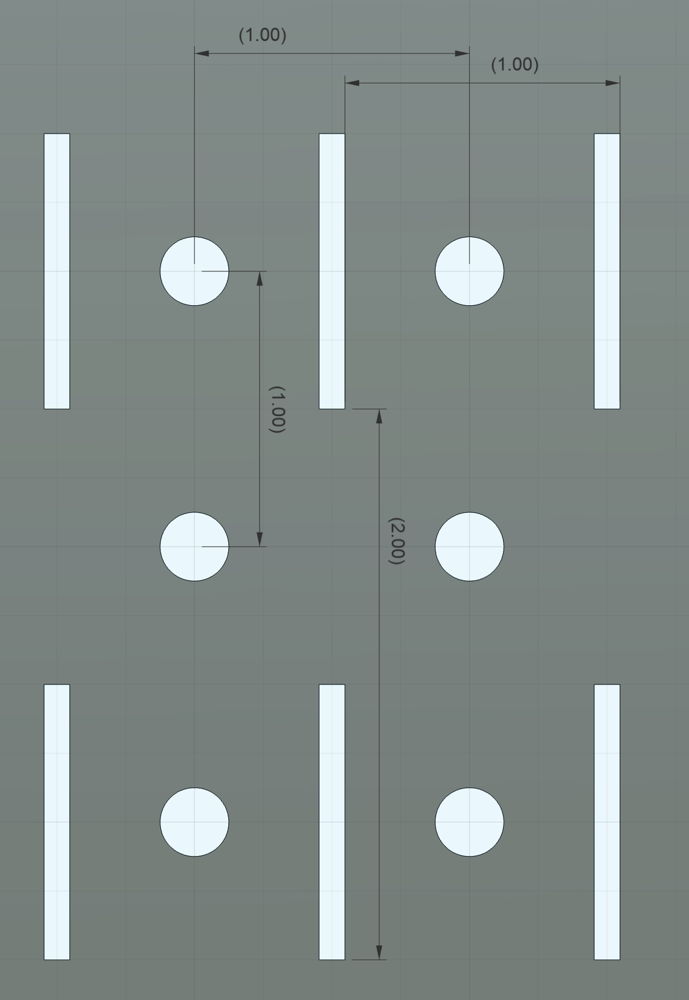
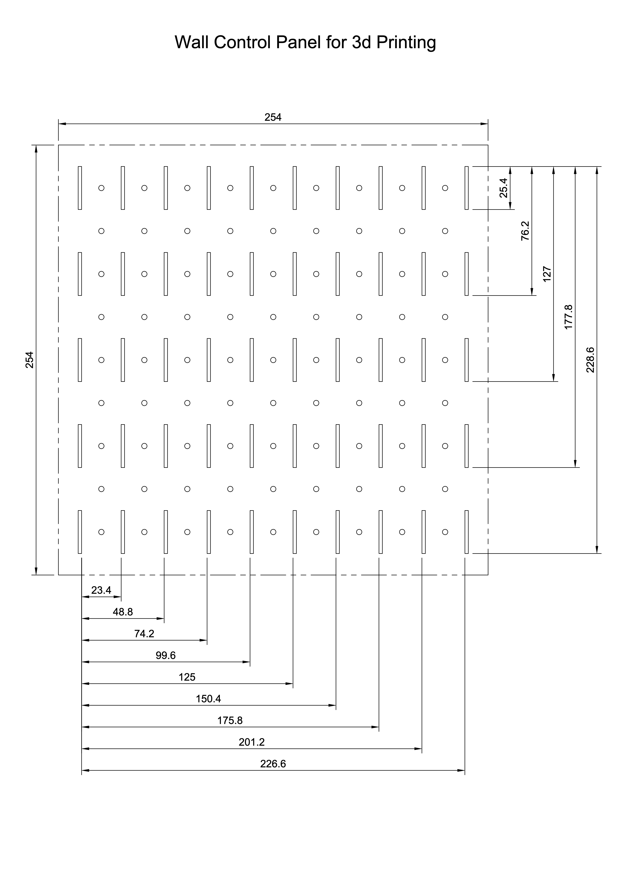

## DDD Compatibility

These are the dimensions I have found to be compatible with the DDD system.  The apparently odd initial sizes (height or width of 1) account for the side pieces required for mounting to the wallcontrol slots

[Square End Measurement](SquareEndMeasurement.png) 

### Dimensions
<table>
    <colgroup span="1"></colgroup>
    <colgroup span="2"></colgroup>
    <colgroup span="2"></colgroup>
    <tr>
        <th colspan="1" scope="colgroup"></th>
        <th colspan="2" scope="colgroup">Width Against Wall 23mm + (25.4mm * (x-1))</th>
        <th colspan="2" scope="colgroup">Height Againsty Wall 25.2mm + (25.4mm * (y-1))</th>
        <th colspan="2" scope="colgroup">Depth From Wall 7.35 + (25.4 * x)</th>
    </tr>
    <tr>
        <th>Units</th>
        <th>mm</th>
        <th>in</th>
        <th>mm</th>
        <th>in</th>
        <th>mm</th>
        <th>in</th>
    </tr>
    <tr>
        <td>1</td>
        <td>23</td>
        <td>0.90551</td>
        <td>25.2</td>
        <td>.99213</td>
        <td>32.75</td>
        <td>1.25</td>
    </tr>
    <tr>
        <td>2</td>
        <td>48.4</td>
        <td>1.90551</td>
        <td>50.6</td>
        <td>1.99213</td> 
        <td>58.15</td>
        <td>2.25</td>
    </tr>
    <tr>
        <td>3</td>
        <td>73.8</td>
        <td>2.90551</td>
        <td>76</td>
        <td>2.99213</td> 
        <td>82.55</td>
        <td>3.25</td>
    </tr>
    <tr>
        <td>4</td>
        <td>99.2</td>
        <td>3.90551</td>
        <td>101.4</td>
        <td>3.99213</td> 
        <td>107.95</td>
        <td>4.25</td>
    </tr>
    <tr>
        <td>5</td>
        <td>124.6</td>
        <td>4.90551</td>
        <td>126.8</td>
        <td>4.99213</td> 
        <td>133.35</td>
        <td>5.25</td>
    </tr>
    <tr>
        <td>6</td>
        <td>150</td>
        <td>5.90551</td>
        <td>152.2</td>
        <td>5.99213</td> 
        <td>158.75</td>
        <td>6.25</td>            
    </tr>
    <tr>
        <td>7</td>
        <td>175.4</td>
        <td>6.90551</td> 
        <td>177.6</td>
        <td>6.99213</td>  
        <td>184.15</td>
        <td>7.25</td>
    </tr>
    <tr>
        <td>8</td>
        <td>200.8</td>
        <td>7.90551</td> 
        <td>203</td>
        <td>7.99213</td>  
        <td>209.55</td>
        <td>8.25</td>
    </tr>
    <tr>
        <td>9</td>
        <td>226.2</td>
        <td>8.90551</td> 
        <td>228.4</td>
        <td>8.99213</td>
    </tr>
    <tr>
        <td>10</td>
        <td>251.6</td>
        <td>9.90551</td> 
        <td>253.8</td>
        <td>9.99213</td>
    </tr>
    <tr>
        <td>11</td>
        <td>277</td>
        <td>10.90551</td> 
        <td>279.2</td>
        <td>10.99213</td>
    </tr>
    <tr>
        <td>12</td>
        <td>302.4</td>
        <td>11.90551</td> 
        <td>304.6</td>
        <td>11.99213</td>
    </tr>
    <tr>
        <td>13</td>
        <td>327.8</td>
        <td>12.90551</td> 
        <td>330</td>
        <td>12.99213</td>
    </tr>
    <tr>
        <td>14</td>
        <td>353.2</td>
        <td>13.90551</td> 
        <td>355.4</td>
        <td>13.99213</td>
    </tr>
    <tr>
        <td>15</td>
        <td>378.6</td>
        <td>14.90551</td> 
        <td>380.8</td>
        <td>14.99213</td>
    </tr>
    <tr>
        <td>16</td>
        <td>404</td>
        <td>15.90551</td> 
        <td>406.2</td>
        <td>15.99213</td>
    </tr>
</table>

### Thickness

8.7mm for full thickness spacers.

    2.35mm space
    4 mm pin socket
    2.35mm space

### Connecting Pins

    Socket:   
    Horizontal Spacing:  
        | --- 7.6mm --- [  10mm  ] --- 15.4 --- [ 10 mm ] --- 7.6mm --- |  
    Vertical Spacing:  
        | --- 6.35 --- | --- 7.7 --- [ 10mm ] --- 15.4 --- [10 mm] --- 7.7 --- |
    

I prefer creating my accessories leaving holes for connecting pins .  This is easier to align and print without dealing with supports on my machine.  DDD provides the model for these connecting pins as well as compatible sides.

### About Wallcontrol

Wallcontrol makes amazing metal slotted pegboard!

The dimensions are 1/4" Holes on 1" center grid, 1" high slots on every other row.

<table>
    <tr>
        <td></td>
        <td></td>
    </tr>

</table>
