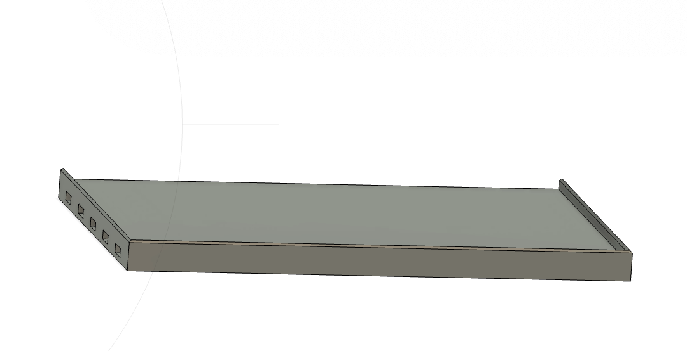

### Drill Bit Storage

I use these to sort and store drill bits.  FastCap has something similar, their KISS Drill Bit Index.  The holder is designed to sit on a shelf, allowing me to store it on the wall but move it around with me as I work if I choose.

## Drill Bit Holder

                
RECIPE: 

1x [Bit Storage](DrillBitHolder.stl)

## Drill Bit Holder Shelf

RECIPE: 

8x [Connecting Pin](https://github.com/aderusha/DDD-Printable-Wall-Control-System/blob/main/Accessories/4x10x8mm%20Pin.stl) 
1x [Left Flat Side 1x0](https://github.com/aderusha/DDD-Printable-Wall-Control-System/blob/main/Sidepieces/Flats/1x0%20Flat%20Left.stl) 
1x [Right Flat Side 1x0](https://github.com/aderusha/DDD-Printable-Wall-Control-System/blob/main/Sidepieces/Flats/1x0%20Flat%20Right.stl) 
1x [Bit Storage Shelf](DrillBitShelf.stl)
