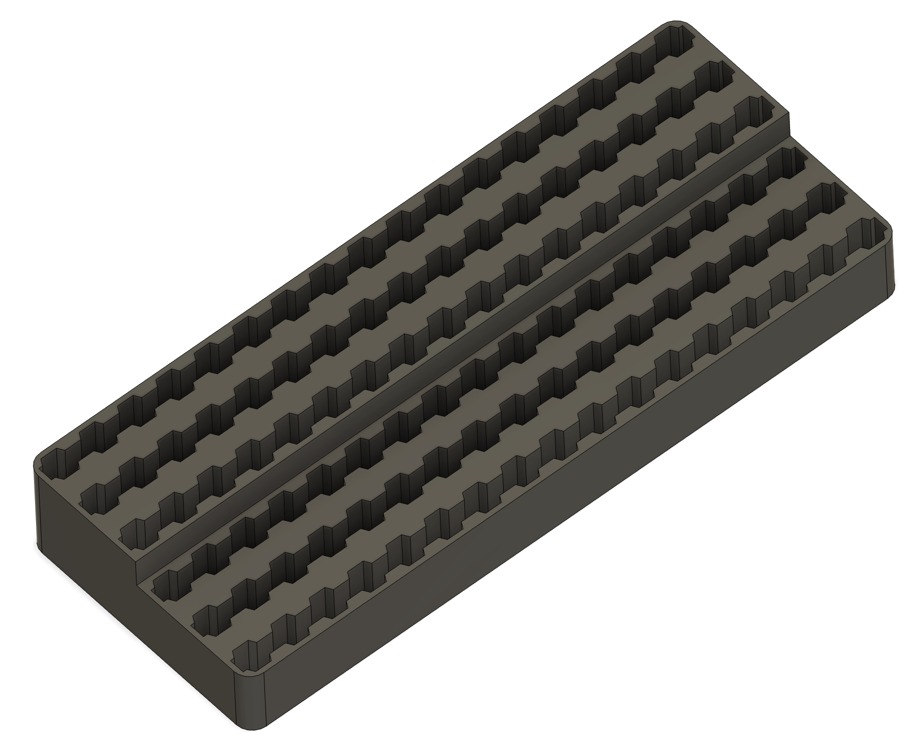
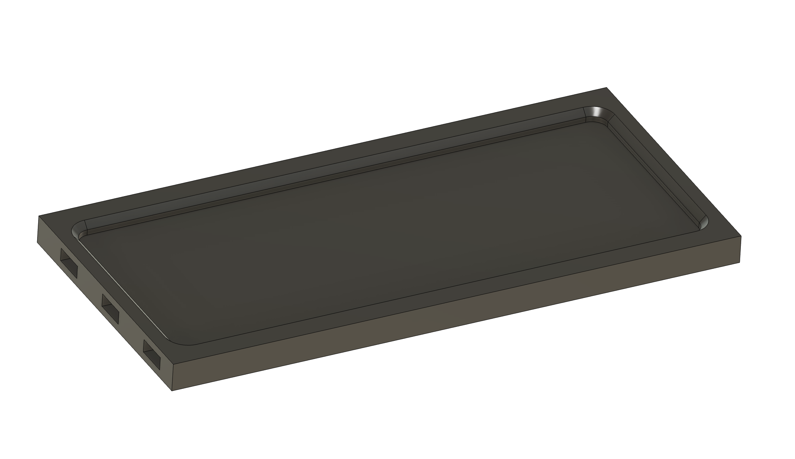

### Hex Bit Storage

I use these to sort and store 1/4" hex bits.  

<table>
  <tr>
    <td>
      
## Hex Bit Holder

                
RECIPE: 

1x [Hex Bit Storage](HexBitHolder.stl)
    </td>
    <td>

## Hex Bit Holder Tray

RECIPE: 

6x [Connecting Pin](../DDD/4x10x8mm%20Pin.stl) 
1x [Angle Bracket Inverted Left 2x3](../DDD/AngleSides/2x3%20Angle%20Bracket%20Inverted%20Flat%20Left.stl) 
1x [Angle Bracket Inverted Right 2x3](../DDD/AngleSides/2x3%20Angle%20Bracket%20Inverted%20Flat%20Right.stl) 
1x [Hex Bit Storage Tray](HexBitTray.stl)
    </td>
  </tr>
</table>

