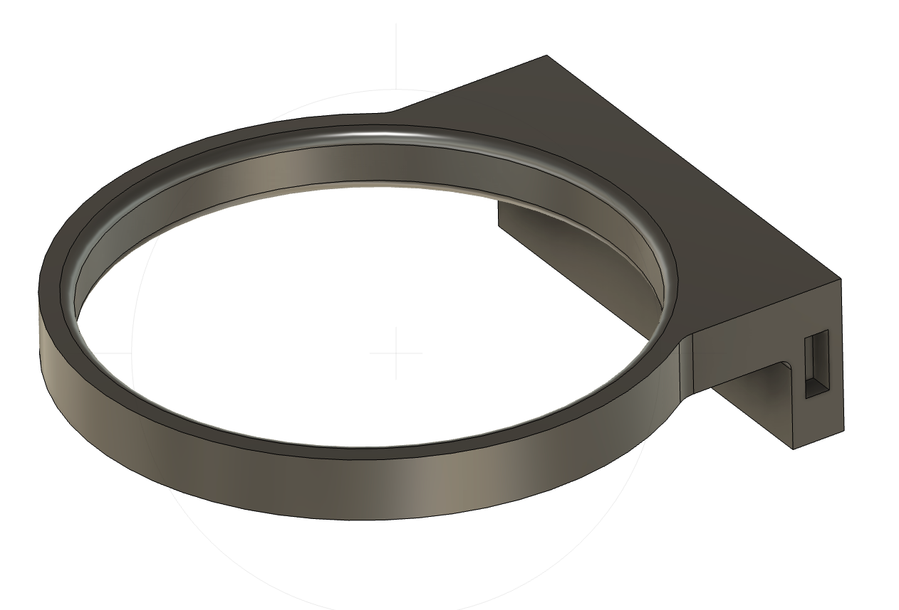

### Wide Mouth Jar Holder

I use these to hold small glass canning jars.  They work wonderfully for storing screws, nuts, bolts and other bits of hardware. They work especially well since you can see thru the glass and identify what you are looking for right away.

                
RECIPE: 

2x [Connecting Pin](../DDD/4x10x8mm%20Pin.stl) 
1x [Left Flat Side 1x0](../DDD/FlatSides/1x0%20Flat%20Left.stl) 
1x [Right Flat Side 1x0](../DDD/FlatSides/1x0%20Flat%20Right.stl) 
1x [Jar Holder](JarHolder.stl)
