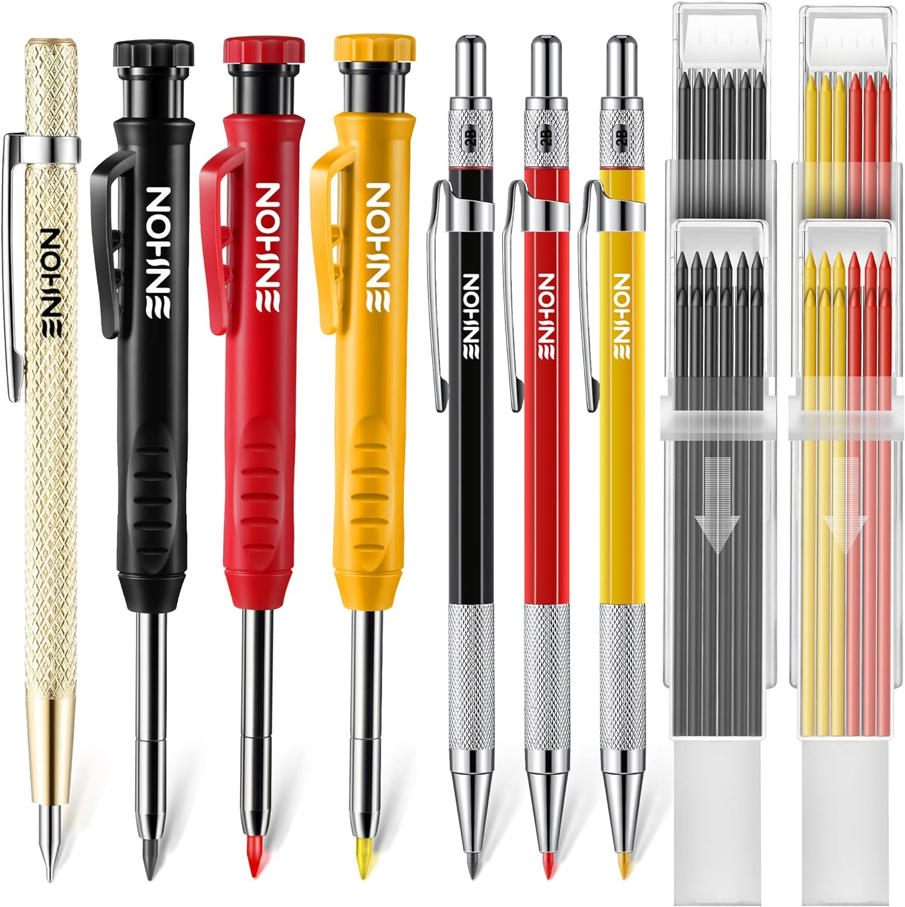
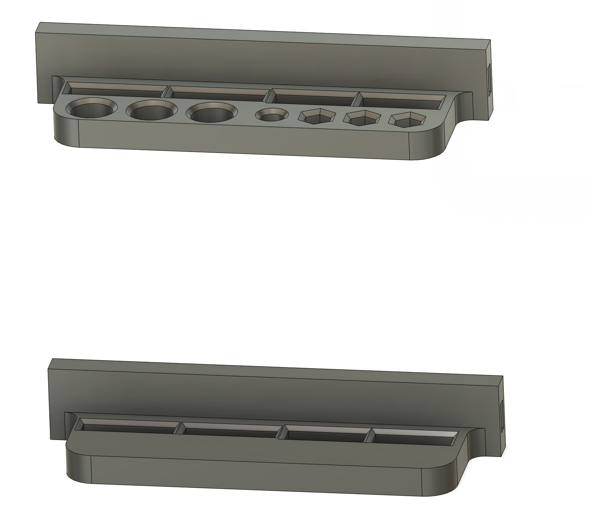
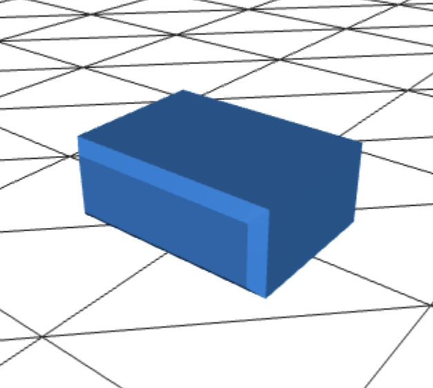

# Measurement & Marking

I use these to organize my measurement and marking tools

<table>
  <tr>
    <th>Item</th>
    <th>Holder</th>
    <th>Recipe</th>
  </tr>
  <tr>
    <td>
      
    </td>
    <td>
      
    <td>
      <table>
        <tr>
          <td>2x</td>
          <td>
            <a href="../DDD/4x10x8mm%20Pin.stl">
              
              Pin
            </a>
          </td>
        </tr>
        <tr>
          <td>1x</td>
          <td>
            <a href="../DDD/FlatSides/1x0%20%20Flat%20Left.stl">
              
              1x0 Flat Left
            </a>
          </td>
        </tr>
        <tr>
          <td>1x</td>
          <td>
            <a href="../DDD/FlatSides/1x0%20%20Flat%20Right.stl">
              
              1x0 Flat Right
            </a>
          </td>
        </tr>
        <tr>
          <td>1x</td>
          <td>
            <a href="./Pen%20Holder%20Top.stl">
              
              Top
            </a>
          </td>
        </tr>
        <tr>
          <td>1x</td>
          <td>
            <a href="./Pen%20Holder%20Bottom.stl">
              
              Bottom
            </a>
          </td>
        </tr>
      </table>
    </td>
  </tr>
</table>
