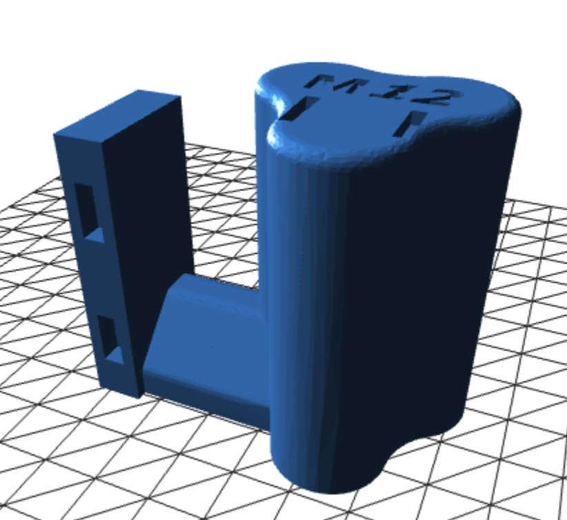
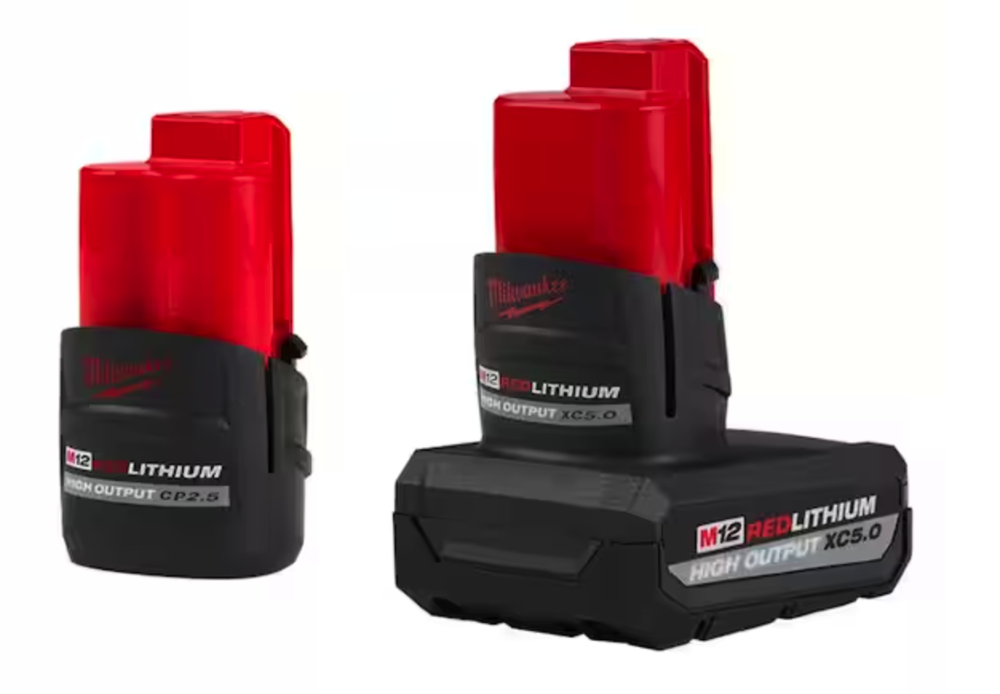

# Milwaukee M12 Device Holders

I use these to hold my Milwaukee M12 tools.

<table>
<tr>
<td>

## Generic M12 Tool Holder

RECIPE:

4x [Connecting Pin](https://github.com/aderusha/DDD-Printable-Wall-Control-System/blob/main/Accessories/4x10x8mm%20Pin.stl) 
1x [Left Flat Side 2x0](https://github.com/aderusha/DDD-Printable-Wall-Control-System/blob/main/Sidepieces/Flats/2x0%20Flat%20Left.stl) 
1x [Right Flat Side 2x0](https://github.com/aderusha/DDD-Printable-Wall-Control-System/blob/main/Sidepieces/Flats/2x0%20Flat%20Right.stl) 
1x [Sideways Holder](https://github.com/aderusha/DDD-Printable-Wall-Control-System/blob/main/Centerpieces/Tool_hooks/2x1_Milwaukee_M12_tool_holder_straight.stl)
</td>
<td>

## Extended Tool Holder

RECIPE:

4x [Connecting Pin](https://github.com/aderusha/DDD-Printable-Wall-Control-System/blob/main/Accessories/4x10x8mm%20Pin.stl) 
1x [Left Flat Side 2x0](https://github.com/aderusha/DDD-Printable-Wall-Control-System/blob/main/Sidepieces/Flats/2x0%20Flat%20Left.stl) 
1x [Right Flat Side 2x0](https://github.com/aderusha/DDD-Printable-Wall-Control-System/blob/main/Sidepieces/Flats/2x0%20Flat%20Right.stl) 
1x [Sideways Holder](https://github.com/aderusha/DDD-Printable-Wall-Control-System/blob/main/Centerpieces/Tool_hooks/2x1_Milwaukee_M12_tool_holder_straight.stl)
</td>
</tr>
<tr>

## Drill Driver (2407-20)

RECIPE: 

4x [Connecting Pin](https://github.com/aderusha/DDD-Printable-Wall-Control-System/blob/main/Accessories/4x10x8mm%20Pin.stl) 
1x [Left Flat Side 2x0](https://github.com/aderusha/DDD-Printable-Wall-Control-System/blob/main/Sidepieces/Flats/2x0%20Flat%20Left.stl) 
1x [Right Flat Side 2x0](https://github.com/aderusha/DDD-Printable-Wall-Control-System/blob/main/Sidepieces/Flats/2x0%20Flat%20Right.stl) 
1x [Drill Driver](Drill&#32;Driver.stl)

</tr>
<tr>
## Hex Driver (2401-20)

RECIPE: 

4x [Connecting Pin](https://github.com/aderusha/DDD-Printable-Wall-Control-System/blob/main/Accessories/4x10x8mm%20Pin.stl) 
1x [Left Flat Side 2x0](https://github.com/aderusha/DDD-Printable-Wall-Control-System/blob/main/Sidepieces/Flats/2x0%20Flat%20Left.stl) 
1x [Right Flat Side 2x0](https://github.com/aderusha/DDD-Printable-Wall-Control-System/blob/main/Sidepieces/Flats/2x0%20Flat%20Right.stl) 
1x [Hex Driver](Hex&#32;Driver.stl)

</tr>
</table>

## Hex Impact Driver (2462-20)

RECIPE: 

4x [Connecting Pin](https://github.com/aderusha/DDD-Printable-Wall-Control-System/blob/main/Accessories/4x10x8mm%20Pin.stl) 
1x [Left Flat Side 2x0](https://github.com/aderusha/DDD-Printable-Wall-Control-System/blob/main/Sidepieces/Flats/2x0%20Flat%20Left.stl) 
1x [Right Flat Side 2x0](https://github.com/aderusha/DDD-Printable-Wall-Control-System/blob/main/Sidepieces/Flats/2x0%20Flat%20Right.stl) 
1x [Hex Impact Driver](Hex&#32;Impact.stl)

## M12 Battery Charger ()

4x [Connecting Pin](https://github.com/aderusha/DDD-Printable-Wall-Control-System/blob/main/Accessories/4x10x8mm%20Pin.stl) 
1x [Left Flat Side 2x0](https://github.com/aderusha/DDD-Printable-Wall-Control-System/blob/main/Sidepieces/Flats/2x0%20Flat%20Left.stl) 
1x [Right Flat Side 2x0](https://github.com/aderusha/DDD-Printable-Wall-Control-System/blob/main/Sidepieces/Flats/2x0%20Flat%20Right.stl) 
1x [M12 Battery Charger](https://github.com/aderusha/DDD-Printable-Wall-Control-System/blob/main/Centerpieces/Tool_hooks/4x3%20Milwaukee%20M12%20Charger.stl)

## M12 Battery Holders ()

4x [Connecting Pin](https://github.com/aderusha/DDD-Printable-Wall-Control-System/blob/main/Accessories/4x10x8mm%20Pin.stl) 
1x [Left Flat Side 2x0](https://github.com/aderusha/DDD-Printable-Wall-Control-System/blob/main/Sidepieces/Flats/2x0%20Flat%20Left.stl) 
1x [Right Flat Side 2x0](https://github.com/aderusha/DDD-Printable-Wall-Control-System/blob/main/Sidepieces/Flats/2x0%20Flat%20Right.stl) 
     --AND-- 
1x [M12 Battery Holder -- 1](https://github.com/aderusha/DDD-Printable-Wall-Control-System/blob/main/Centerpieces/Tool_hooks/2x2_milwaukee_M12_battery_x1.stl) 
     --OR-- 
1x [M12 Battery Holder -- 2](https://github.com/aderusha/DDD-Printable-Wall-Control-System/blob/main/Centerpieces/Tool_hooks/2x5_milwaukee_M12_battery_x2.stl) 
     --OR-- 
1x [M12 Battery Holder -- 3](https://github.com/aderusha/DDD-Printable-Wall-Control-System/blob/main/Centerpieces/Tool_hooks/2x8_milwaukee_M12_battery_x3.stl) 

