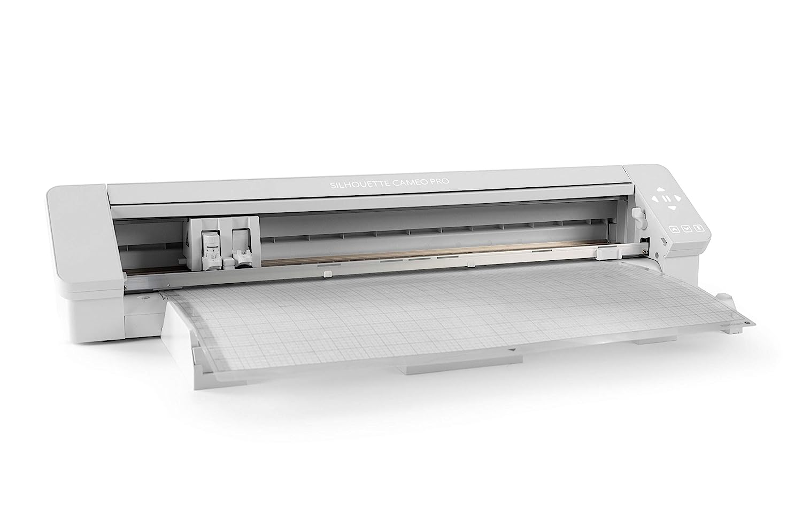

# wallcontrol

## Accessories for WallControl Organizer

These are 3d printable accessories that I have created or modified to organize my space.
They are based on the excellent DDD system by aderusah (https://github.com/aderusha/DDD-Printable-Wall-Control-System)
 
 
<table>
    <tr>
        <td>
            <a href="Vinyl/README.md">
                
                
Vinyl Cutter Models

            </a>
        </td>
        <td>
            <a href="MilwaukeeM12/README.md">
                
                
Milwaukee Tool Models

            </a>
        </td>
    </tr>
</table>

### About Wallcontrol

Wallcontrol makes amazing metal slotted pegboard!

The dimensions are 1/4" Holes on 1" center grid, 1" high slots on every other row.

## DDD Compatibility

These are the dimensions I have found to be compatible with the DDD system.  The apparently odd initial sizes (height or width of 1) account for the side pieces required for mounting to the wallcontrol slots

### Width

23mm + (25.4mm * (x-1))     Where x is the width of the accessory in slots
<ol>
    <li>23 mm</li>
    <li>48.4 mm</li>
    <li>73.8 mm</li>
    <li>99.2 mm</li>
    <li>124.6 mm</li>
    <li>150 mm</li>
    <li>175.4 mm</li>
</ol>

### Height

25.2 + (25.4 * (y-1))       Where y is the height of accessories in hole spaces (1 inch on center)
<ol>
    <li>25.2 mm</li>
    <li>50.6 mm</li>
    <li>76 mm</li>
    <li>101.4 mm</li>
</ol>

### Thickness

8.7mm for full thickness spacers.

### Connecting Pins

I prefer creating my accessories leaving holes for connecting pins .  This is easier to align and print without dealing with supports on my machine.  DDD provides the model for these connecting pins as well as compatible sides.

Pin Dimensions:  4mm Tall, 4mm Deep, 10mm Wide

Pin:    [Pin Model](https://github.com/aderusha/DDD-Printable-Wall-Control-System/blob/main/Accessories/4x10x8mm%20Pin.stl)

Sides:  [Flat Sides](https://github.com/aderusha/DDD-Printable-Wall-Control-System/tree/main/Sidepieces/Flats)
