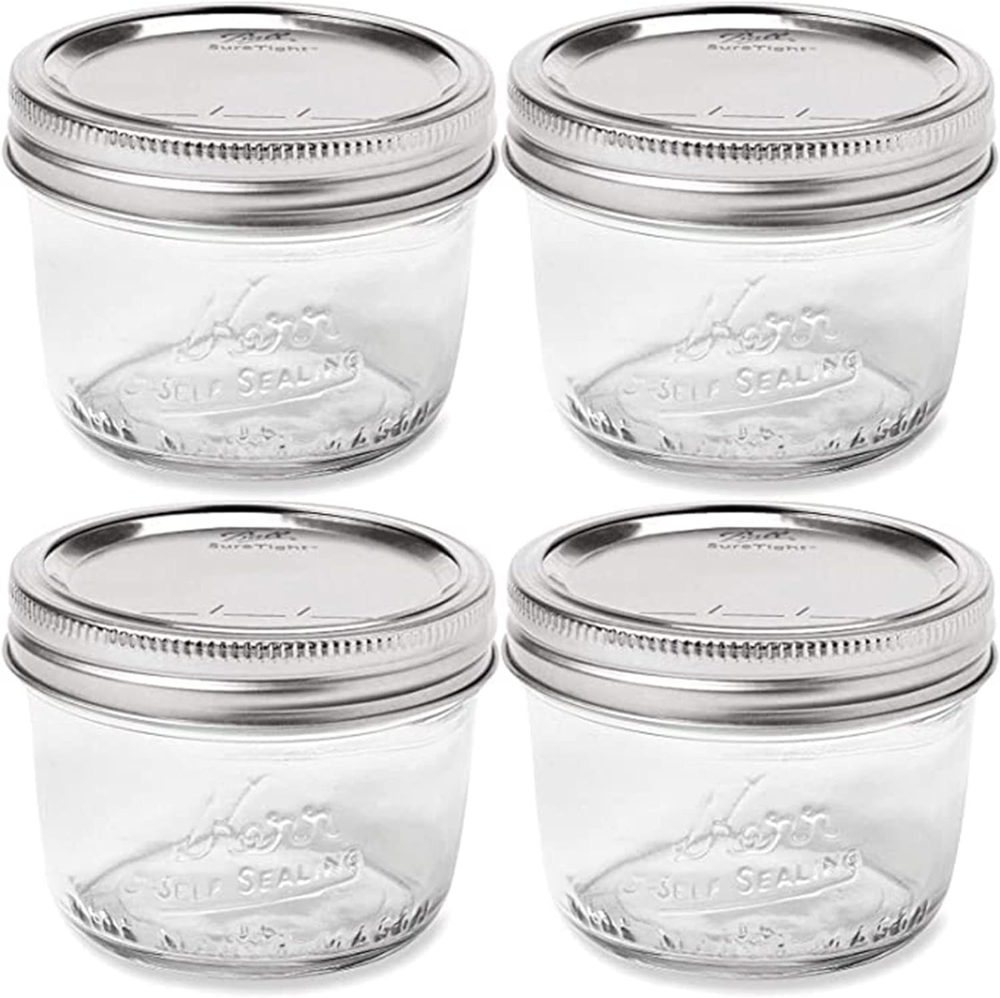
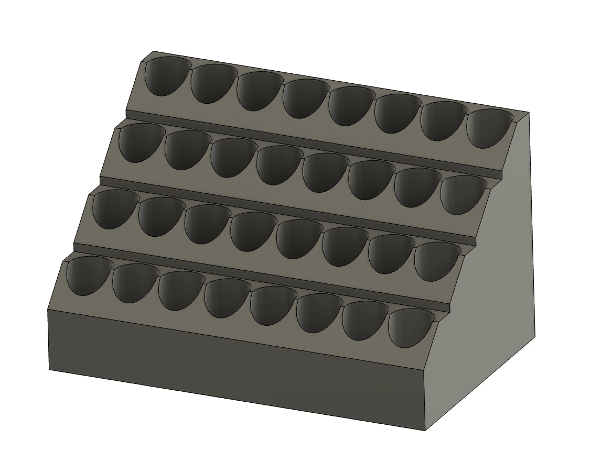

## Wall Control 3D Printed Models

These are 3d printable accessories that I have created or modified to organize my space in the garage. 
I use panels from <a href="http://www.wallcontrol.com">Wall Control</a>.
Many of my models are based on the excellent [DDD system](https://github.com/aderusha/DDD-Printable-Wall-Control-System)  by aderusah 

### Wall Control Measurements
<a href="About/README.md">Wall Control Measurements</a>
 

 
<table>
    <tr>
        <td>
            <a href="Vinyl/README.md">
                
                
Vinyl Cutter Models

            </a>
        </td>
        <td>
            <a href="MilwaukeeM12/README.md">
                
                
Milwaukee Tool Models

            </a>
        </td>
    </tr>
    <tr>
        <td>
            <a href="Jars/README.md">
                
                
Glass Canning Jars

            </a>
        </td>
        <td>
            <a href="Bits/README.md" width="400"/>
                
                
Drill Bit Storage

            </a>
        </td>
    </tr>
</table>
