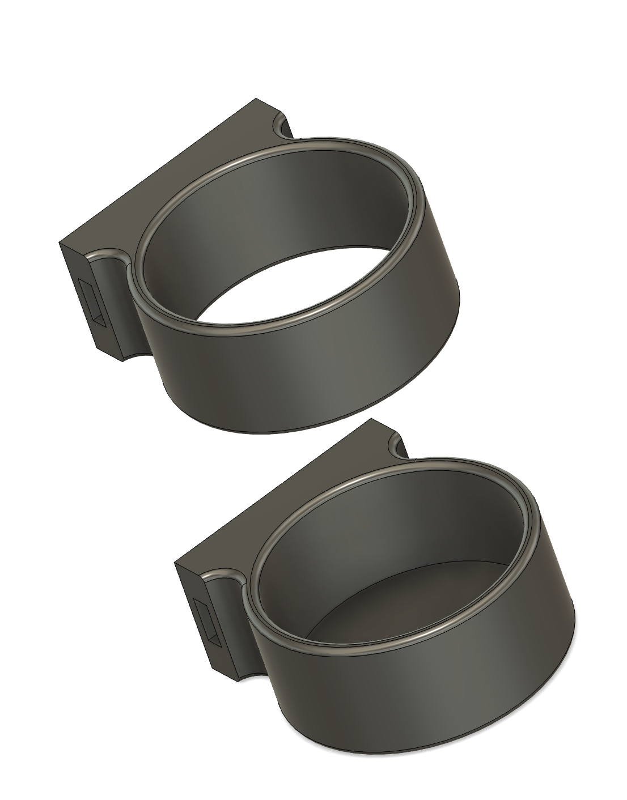

### Vinyl Roll Holder

I used these to hold rolls of vinyl for my vinyl cutter (Sillhouette Cameo Pro).  Because I use both 12" and 24" rolls, I made the bottom holder and the support center separate.  This allows you to space them at whatever height you desire.

RECIPE: 

2x [Connecting Pin](https://github.com/aderusha/DDD-Printable-Wall-Control-System/blob/main/Accessories/4x10x8mm%20Pin.stl) 
1x [Left Flat Side](https://github.com/aderusha/DDD-Printable-Wall-Control-System/blob/main/Sidepieces/Flats/1x0%20Flat%20Left.stl) 
1x [Right Flat Side](https://github.com/aderusha/DDD-Printable-Wall-Control-System/blob/main/Sidepieces/Flats/1x0%20Flat%20Right.stl) 
1x [Vinyl Roll Holder (2 parts)](Vinyl%20Holder.stl)
